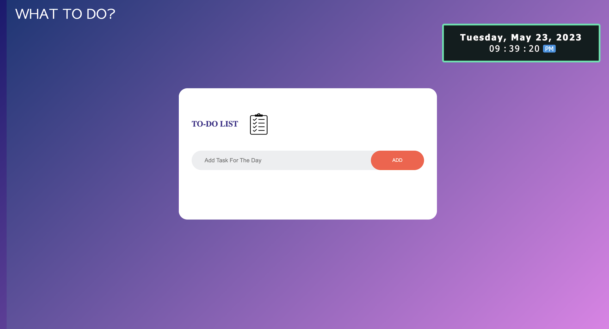
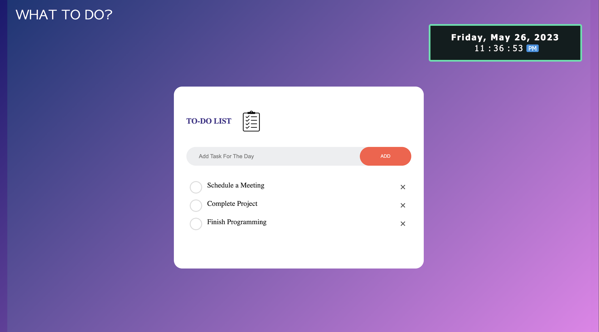

<!-- PROJECT LOGO -->
 

  
  <h3 align="center">WHAT TO DO?</h3>

  

    A To-Do app that keeps track of one's day to day objectives. A versatile app that can keep track of all sorts of tasks!
     
    <a href="https://what-to-do.hasanabdulla.repl.co/"><strong>HOME PAGE</strong></a>
  

<!-- TABLE OF CONTENTS -->

  
Table of Contents

  <ol>
    <li>
      <a href="#about-the-project">About The Project</a>
    </li>
    <li><a href="#contact">Contact</a></li>
  </ol>

<!-- ABOUT THE PROJECT -->
## About The Project

There are many beneficial factors to "WHAT TO DO?" as it was designed to be a multi-purpose application. From keeping tabs on your academic to-do's and goals to managing a work schedule, the application can handle all forms of ensuring an individual stays up to date with their goals and objectives.

<!-- CONTACT -->
## Contact

Your Name - [Hasan Abdulla](https://www.linkedin.com/in/hasan-abdulla1903/) - ishabdulla26@gmail.com

Project Link: [https://github.com/hAbdulla19/TO-DO-APP](https://github.com/hAbdulla19/TO-DO-APP)
